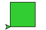

.. RGB Colour Square

Colour in the computer
######################

This project explores how colour is represented as numbers in a computer,
by showing the colours you can mix on your screen,
from the basic red, green and blue that a monitor can produce.
It assumes you know about for-loops and functions.
It introduces the idea of tuples to represent colour.

Red, Green, Blue
****************

Start the project by making an empty file ``rgb.py``.
Right-click and open it with IDLE.
Type in the editor:

.. code-block:: python

   # Explore RGB colour
   from turtle import *

   def square(a, c):
       fillcolor(c)
       begin_fill()
       for i in range(4):
           forward(a)
           left(90)
       end_fill()

Save and run this file. Then in the shell type::

   >>> square(50, "lime green")

You should get a filled square of size 50.

.. sidebar:: RGB colour in web pages

   On web pages,
   in HTML and CSS,
   you can use similar names to the ones in the ``turtle`` module.
   (Just remove the spaces.)

   .. image:: css.png
      :align: center

   You can also use the notation ``rgb(20%, 80%, 20%)``
   (that's lime green again).
   This is the method most like the tuples that ``turtle`` uses.

   .. image:: css2.png
      :align: center

   You will most often see colours written in hexadecimal.
   "lime green" is ``#50CD50``.
   Python ``turtle`` can understand these hexadecimal colours too,
   but humans shouldn't have to.

This command,
and the code in most other projects in this set,
select colours by name.
It is difficult to know what names you can use,
or what they mean.
(Look up "X11 colour names" in Wikipedia
if you care about the difference between
"light goldenrod" and "papaya whip".)

Run the program again, just to clear the screen, and type::

   >>> square(50, (.2, .8, .2) )

You should get exactly the same filled square as before.

In the ``turtle`` module,
the names for colours are turned into 3 numbers,
that can be written in like this ``(r, g, b)``.
This is called a ``tuple`` in Python.
A ``tuple`` is a lot like a list,
except that you can't change what's in it.

The numbers in a colour ``tuple`` have to be between zero and one.
They represent the amount or red, green and blue in the colour,
in that order.
``(1,0,0)`` is red,
``(0,1,0)`` is green,
``(0,0,1)`` is blue,
and ``(0,0,0)`` is black.
Every other colour is a mixture of some kind.
We call this the "RGB model".
Try a few mixtures::

   >>> square(50, (.5, 0, 0))
   >>> square(50, (.5, .7, 0))
   >>> square(50, (.5, .3, 0))
   >>> square(50, (.5, .3, .6))

Remember, you don't have to type all this:
pull down the previous line with up-arrow and the enter key,
then change the parts that should be different.

An RGB colour square
********************

.. sidebar:: Red + green = yellow?!

   .. image:: rg_square.png
      :align: center
      :scale: 50%

   The design you get from ``rg_square(200)``
   mixes green and red light in different amounts,
   and the amount of blue is zero.
   Was it a surprise to find yellow at the top right?

   Take a close look at this on your screen.
   You'll see only green and red dots.
   Stand back and yellow is what your brain sees.
   There *is* such a thing as *real, yellow light*,
   that has a wavelength between red and green. 
   Light waves from a yellow LED
   or the older kind of streetlamp
   are 590 billionths of a metre long.

   Your eyes have red, green and blue sensors,
   but they're not very precise.
   Real yellow light is between red and green,
   and excites the sensors about equally.
   So that's all the computer has to do
   to make you see yellow.

   There are infinitely more colours in real life
   than human eyes can see, or your monitor produce.

Let's write a program to experiment some more with RGB colours.

We need a program that will step though colour combinations,
and show each of them to us.
Because there are three colours, this is a little messy,
but for two colours we can make a grid of little squares.
**Add** this function,
and short program,
to your code:

.. code-block:: python
   :emphasize-lines: 6, 11

   def rg_square(a, blue=0, N=10):
       # N+1 little squares wide so ...
       a = a/(N+1)
       start = position()
       for i in range(N+1):
           green = i/N
           # Go to start of row i
           setposition( start + (0,i*a) )
           for j in range(N+1):
               # Draw square j on row i
               red = j/N
               c = (red, green, blue)
               square(a, c)
               forward(a)
       setposition(start)

   # Program
   hideturtle()
   penup()
   speed("fastest")

   rg_square(200)

There are two loops in ``rg_square``,
one inside the other.
The inner one draws a row of squares with increasing amounts of red.
The outer one chooses increasing amounts of green in each row.
Save and run.
You should see 121 different combinations of red and green.

Finally, let's experiment with adding blue.
**Add** this function to your code:

.. code-block:: python

   from time import sleep

   def rgb_cube(a, N=10):
       for b in range(N):
           blue = (b+1)/N
           rg_square(a, blue, N)
           sleep(1)
           update()

**Change** your program to call the new function instead of ``rg_square``:

.. code-block:: python

   # Program
   hideturtle()
   penup()
   bgcolor((0,0,0))
   tracer(0)

   rgb_cube(200)

This begins with the same red-green square as before,
then it adds more and more blue (in 10 steps).
You can think of these as layers of a cube that has red-green on the bottom,
and increasing amounts of blue as you go higher.
What you see at the end is the top of the cube.
Just for fun, try bigger values of ``N``.

