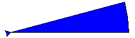

.. HSL Colour Wheel

Colour gets arty
################

This project looks at colour the way a website developer
or graphic artist might.
It draws a colour wheel using hue and lightness.
It makes use of named and default arguments to functions.
It is helpful to have done the RGB colour project, but not essential.

RGB and HSL colour
******************

Colour is stored in your computer
in the same way that it is put on your screen:
as amounts of red, green and blue light.
This is called the RGB model.
You may already have looked at this in the RGB colour project.

If you are a web designer,
or choosing colours for your room,
the RGB model is not the best way to think about colour.
You might prefer to think in these terms:

* *hue*: the actual colour, where it belongs in the rainbow.
* *saturation*: how strong the colour is; how different it is from grey.
* *lightness*: a scale from black (0),
   through brightly-coloured (0.5), to white (1).

This is called the HSL model.
In this project you will use the Python library module called ``colorsys``
to convert from HSL to the RGB model that ``turtle`` needs.

A colour wheel
**************

Start the project by making an empty file ``wheel.py``.
Right-click and open it with IDLE.

You're going to make a sort of circular rainbow,
where the *hue* goes from zero to one.
At each hue, you will draw a thin pie-slice (a sector) in that colour.
Type in the editor:

.. code-block:: python

   # Explore HSL colour
   from turtle import *
   import colorsys

   def sector(r, angle, c):
       "Sector filled with colour c" 
       fillcolor(c)
       begin_fill()
       forward(r)
       left(90)
       circle(r, angle)
       right(90)
       backward(r)
       end_fill()

Save and run this file. Test this function in the shell by typing::

   >>> sector(200, 15, (0,0,1))

You should see a blue sector:

(If it didn't work, debug your code.)
In the function call, we specified the colour as an RGB tuple ``(0,0,1)``,
meaning no red, no green, and ``1`` full unit of blue.
(The numbers in a colour tuple are fractions that run from zero to one.)

.. sidebar:: Colour in website design

   .. image:: hsl_24.png
      :align: center

   Web designers take a lot of care over the colours they use.
   One simple way to get a pleasing set of colours
   is to choose the same hue for all of them.

   Here is a set of 5 colours that all have the same hue (0.3),
   but have different saturation and lightness:

   .. image:: hsl_palette.png
      :align: center

   .. in web terms these are:
       #41a328
       #234c19
       #c2dbbc
       #6ee051
       #32ff00

   A designer might use the first three for headings, text and background,
   and the last two for boxes and graphical highlights.
   The use of a single hue means all the colours go well together.
   The different saturation and lightness ensure that
   text can be read against the page background
   and a small amount of the brightest colour catches the eye.

Now we want to piece together a circle
from sectors of different colour.
The angle of the sectors has to add up to 360 degrees.
**Add** this function to your code after the ``sector`` function:

.. code-block:: python
   :emphasize-lines: 4

   def wheel(r, sat=1.0, light=0.5, N=24):
       "A colour wheel of radius r with N sectors"
       for i in range(N):
           c = colorsys.hls_to_rgb(i/N, light, sat)
           sector(r, 360/N, c)

Notice that the Python library likes to call the HSL model the *HLS* model.
(Both are ok,
just be careful with the order of the arguments, when you use it.)
And when we call it, we have to mention the module ``colorsys`` in front:
this is because we used a different kind of import statement.
As a test,
save and run,
then try ``wheel(200)`` at the shell prompt.

**Add** this program at the end of your code:

.. code-block:: python
   :emphasize-lines: 4, 10

   # Program
   hideturtle()
   penup()
   tracer(0)

   K = 50
   for k in range(K):
       r = 300*(1-k/K)
       wheel(r, light=(K-k-1)/K, sat=1.0, N=120)
       update()

``tracer(0)`` makes the program run fast
by putting off drawing until the call to ``update``.

Save and run this.
You should see a wheel of all the hues,
like the one in the sidebar.
*Lightness* runs from zero in the middle (black),
to 1 at the rim (white).

To learn how *saturation* affects colour,
try altering ``sat=1.0`` to ``sat=0.5``.
How would you change the program to display varying saturation,
at a lightness you choose?
(Remember, a lightness of 0.5 is the most colourful.)

