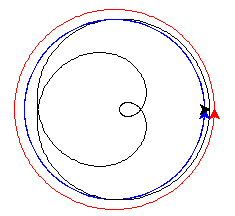
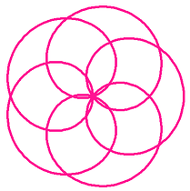
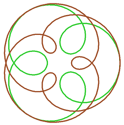

.. Project on the Cyclic Trochoid

Celestial Wheels
################

This project draws a loopy curve,
that mathematicians call an epitrochoid,
and everyone else calls a spirograph pattern.
It introduces the idea of an object and its methods.

Turtles, turtles, turtles
*************************

Start the project by making an empty file ``loo.py``.
Right-click and open it with IDLE.
Type in the editor::

   # Fun with epitrochoids
   from turtle import *

In the introduction we used only one turtle,
and so your commands like ``forward`` and ``left``,
went to that unnamed turtle.
Here you'll create two other turtles,
and send your commands to each of them by name.

Let's see how this works.
Save and run your program,
so the ``import`` happens and the shell opens.
This is how you make a new turtle,
and a variable ``ted`` to refer to it.
Try this in the shell window::

   >>> ted = Turtle()

Now we can give ``ted`` the turtle some things to do::

   >>> ted.color("blue")
   >>> ted.left(60)
   >>> ted.forward(100)

These instructions are just like function calls.
A function addressed to a particular object is called a *method*.
The dot ``.`` is how you address a *method* to an object in Python.
It has to be something the object knows how to do, so::

   >>> ted.print()

raises an error.
``print`` is a valid *function*,
but it is not a *method* of ``Turtle`` objects.

Setting up the guide turtles
****************************

.. sidebar:: Calculating with positions

   A position is described with two numbers ``(x,y)``.
   ``x`` is how far it is right of home,
   and ``y`` is how far it is up from home.
   We call this pair a *vector*.
   A movement,
   from one position to another,
   is a vector too: move ``x`` right, and ``y`` up.

   What was going on when you typed this?

   .. code-block:: python

       >>> mid = (1/2) * (p+q)

   When you add two vectors,
   Python knows to add the x-parts together to get the x-part of the result,
   then the same with the y-parts::

       >>> p+q
       (150.00,50.00)

   Subtraction works the same way.
   You can also multiply a number (called a *scalar*)
   and a vector together::

       >>> (1/2) * (p+q)
       (75.00,25.00)

   Congratulations, you just learned some year 10 maths!

We need two "guide" turtles,
each of which draws a circle.
Each has to be set up a certain distance from home,
so **add** this function to your code:

.. code-block:: python
   :emphasize-lines: 3, 11

   def new_guide(r, c):
       "Return a new guide turtle of radius r and colour c"
       t = Turtle()
       t.speed("fastest")
       t.color(c)
       # Go to (r,0) without drawing
       t.penup()
       t.setposition(r,0)
       t.left(90)
       t.pendown()
       return t

Notice this function *returns* a turtle.
Save and run, then try this in the shell::

   >>> g = new_guide(100, "blue")
   >>> p = g.position()
   >>> g.circle(50, 90)
   >>> q = g.position()
   >>> 
   >>> mid = (1/2) * (p+q)
   >>> setposition(mid)

You should see this:

   .. image:: epi_midpoint.png

The unnamed turtle (black)
has moved halfway between start and end of the blue arc.

Moving the guides
*****************

The first job is to make the guides move in their orbits.
**Add** this to your program at the end:

.. code-block:: python

   def epitrochoid(a, b, L, M=1):
       ta = new_guide(a, "blue")
       tb = new_guide(b, "red")
       # N little steps s make one circle
       N = 500
       s = 360/N
       for i in range(N):
           # ta will go L times round
           ta.circle(a, L*s)
           # tb will go M times round
           tb.circle(b, M*s)

   # Test
   epitrochoid(90, 100, 3, 2)

Save and run.
You should see blue and red circles drawn.

The blue turtle goes round L=3 times, and the red turtle M=2 times.
You can see how this works in the code.
``N`` just has to be a big enough number to make the final curve smooth.
``N`` steps of size ``s`` make 360 degrees, exactly one circle.
So ``N`` steps of ``L`` or ``M`` steps make ``L`` or ``M`` full circles.

``M=1`` on the first line says that,
if you don't give it a value in the call to ``epitrochoid``,
``M`` will be equal to 1.

Compute the shape
*****************

The shape we are looking for is drawn by
keeping our pen mid-way between the two guides.

**Change** the ``epitrochoid`` function to add these lines:

.. code-block:: python
   :emphasize-lines: 2, 5-11, 20-21

   def epitrochoid(a, b, L, M=1):
       "Epitrochoid: a, b are guide radii; L, M the number of orbits."
       ta = new_guide(a, "blue")
       tb = new_guide(b, "red")
       # Local function for midpoint between the guides
       def midpoint():
           return (1/2) * (ta.position() + tb.position())
       # Set start position for unnamed turtle
       penup()
       setposition(midpoint())
       pendown()
       # N little steps s make one circle
       N = 500
       s = 360/N
       for i in range(N):
           # ta will go L times round
           ta.circle(a, L*s)
           # tb will go M times round
           tb.circle(b, M*s)
           # unnamed will be half-way between them
           setposition(midpoint())

Save and run.
You should see this:

Tidy up
*******

It would be nice if the guide circles were not on the final drawing.
**Add** this tidy-up code at the end of ``epitrochoid``,
and style the unnamed turtle to your liking:

.. code-block:: python
   :emphasize-lines: 8-10, 12-15, 17-19, 24

   def epitrochoid(a, b, L, M=1):

       ta = new_guide(a, "blue")
       tb = new_guide(b, "red")
       .
       .
       .
       # Erase guides
       guide_erase(ta)
       guide_erase(tb)

   def guide_erase(t):
       "Erase what turtle t drew"
       t.hideturtle()
       t.clear()

   speed("fastest")
   width(5)
   color("lime green")

   # Test
   epitrochoid(90, 100, 3, 2)

   hideturtle()

.. sidebar:: Roman astronomy

   Early astronomers took the Earth to be stationary,
   with the Sun, Moon and planets moving round it.   
   If you take careful measurements of the position of a planet in the sky,
   you find it speeds up, slows down, and sometimes travels backwards.
   The Roman astronomer Ptolemy (around AD 145)
   deduced from this that the planets moved in cycles
   like the ones you are drawing.

   .. image:: 244px-Cassini_apparent.jpg
      :align: center

   In this theory,
   the orbit of Venus has the shape you get from::

       epitrochoid(230, 300, 13, 8)

   .. image:: epi_venus.png
      :align: center
      :width: 100%

   In the 16th century,
   when the telescope let us see the planets more clearly,
   we understood that the Earth and Venus both orbit the Sun,
   The *difference* of these two orbits is the motion Ptolemy observed.

Inspiring examples
******************

Try changing the numbers in the call to ``epitrochoid`` like this::

   a, b = 100, 300
   epitrochoid(a, b, 4)
   color("goldenrod")
   epitrochoid(a, b, 5)
   color("sienna")
   epitrochoid(a, b, 6)

(Remember, M=1 if you don't give a fourth argument.)
Suppose you change just one line now::

   a, b = -100, 300

and run again. When the loops point outwards,
the shape is called a hypotrochoid.

What's happening here?

.. code-block:: python

   a, b = 250, 300
   epitrochoid(a, b, 4)
   color("goldenrod")
   epitrochoid(a, b, 5)
   color("sienna")
   epitrochoid(a, b, 6)

And what about here?

.. code-block:: python

   L = 6
   a, x = 50, 80
   epitrochoid(a, L*a, L)
   color("goldenrod")
   epitrochoid(a, L*a + x, L)
   color("sienna")
   epitrochoid(a, L*a - x, L)

Find other interesting shapes of your own.

Some advanced questions
***********************

If you like investigating mathematical patterns,
this code project poses some interesting questions.

* What determines the number of loops?
* What values for ``a`` and ``b`` make the curve pass through (0,0)?
  (Hint: where would the guide turtles be at that moment?)

A shape in this family, where the curve passes through zero, is called a "rose".

* When do the loops become points?
* Both curves below have 3 loops: what is the difference between them?

