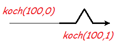
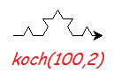

.. Koch snowflake

The Koch Snowflake
##################

This project draws a fractal curve,
with only a few lines of turtle graphics code.
It assumes you know about for-loops and functions.
And it introduces the computer science idea of recursion.

The basic unit
**************

Start the project by making an empty file ``koch.py``.
Right-click and open it with IDLE.

We're going to define a function that *either*
draws a line with a kink in it,
*or* draws a straight line the same length.
Which one it does
will depend on whether the argument ``order`` is greater than zero.
Type this in the editor, save it (ctrl-S) and run it (F5):

.. sidebar:: A bit of geometry

   In the ``order=1`` case this function draws a carefully-designed curve:

   .. image:: koch_order_1.png
      :align: center

   Each of the 4 lines is ``a/3`` long,
   and because of the choice of angles,
   the distance between the ends of the line is ``a``.

.. code-block:: python
   :emphasize-lines: 5, 9

   # Draw a Koch snowflake
   from turtle import *

   def koch(a, order):
       if order > 0:
           for t in [60, -120, 60, 0]:
               forward(a/3)
               left(t)
       else:
           forward(a)

   # Test
   koch(100, 0)
   pensize(3)
   koch(100, 1)

The symbol ``>`` means "greater than".
Be careful about the indenting (the spaces before each line).
You should get this:

Recursion
*********

This is where your head explodes.
You will replace the ``forward(a/3)`` with another call to ``koch``,
to draw a kinked line of the same length.
That's a line with 4 parts, ...

* and each of those parts has 4 parts,
* and each of those parts has 4 parts,
* and each of those parts has 4 parts, ...

Well, not in practice.
In practice,
the variable ``order`` goes down by one each time,
and when it hits zero, we just draw a line.
**Change** the function ``koch``, just a little:

.. code-block:: python
   :emphasize-lines: 2

           for t in [60, -120, 60, 0]:
               koch(a/3, order-1)
               left(t)

When a function calls itself, we say it is *recursive*.
*Recursion* can solve problems that simple iteration (like a for-loop) cannot.

Save and run.
You will get the same two curves as before, because of the test code.
But try this in the shell::

   >>> reset()
   >>> koch(100, 2)

Now each line segment has become a Koch curve.
There are 16 little lines.

What happens for ``koch(100,3)`` or ``koch(100,4)``?
The order 4 curve has 256 tiny lines.
One thing that happens is that it starts to take a long time to draw.
A call to ``speed("fastest")`` before you start drawing will help.

.. sidebar:: The real Koch Curve

   Helge von Koch was a Swedish mathematician.
   He wanted to prove a curve could exist that was:

   * Continuous (you draw it without lifting up your pen).
   * Not smooth anywhere (all "corners").

   The real Koch Curve is not any of the things you have drawn.
   The real Koch curve is what these drawings get closer and closer to
   as the order goes up,
   and the lines get smaller.
   Mathematicians call things defined that way a *limit*.

   The curves we draw all have smooth (straight line) segments.
   But they *look* like the Koch curve,
   once the straight parts are too small for us to see.

   .. image:: koch_order_5.png
      :align: center

   Look at the Koch curve drawing, or snowflake, for order 5 or more.
   Do you see how the same 3-lobe pattern repeats at different sizes and angles?
   The whole curve contains miniature versions of itself,
   smaller and smaller, down into invisibility.
   This is a property of *fractals*.
   We say the curve is *self-similar*.

   You can easily see how *recursion* makes that happen.
   In the code we have to stop eventually;
   in the real Koch curve, it goes on forever.

Need for speed
**************

The drawing is still too slow once ``order`` is 6 or more.
(The calculation is fast.)
The ``turtle`` module wants to show you every change as it is happening:
good when debugging,
not so good when you just want the result.

We can delay putting the actions on the screen with the ``tracer`` function.
But then we have to tell it to appear using the ``update`` function,
when we're ready.

Looks like snow
***************

The snowflake is made from 3 Koch curves.
Although there are only 3 "sides",
it has 6-fold symmetry, like a real snowflake.

Delete the test code from your program,
and **add** this program at the end:

.. code-block:: python

   # Choose colours and size
   color("sky blue", "white")
   bgcolor("black")
   size = 400
   order = 0

   # Ensure snowflake is centred
   penup()
   backward(size/1.732)
   left(30)
   pendown()

   # Make it fast
   tracer(100)
   hideturtle()

   begin_fill()

   # Three Koch curves
   for i in range(3):
       koch(size, order)
       right(120)

   end_fill()

   # Make the last parts appear
   update()

Save and run. This should give you a big, white triangle.
Adjust ``size`` so it nicely fills the drawing window when run.
Now set ``order`` to 6 or 7.
Run the program and enjoy the result.

How many sides does this have?
(Hint: every time the order goes up by one, there are 4 times as many.)

