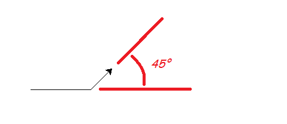

.. Write a program

IDLE: write a program
#####################

You're using Python, but you haven't written a program yet.
A program has instructions like the ones you've typed,
but they're saved so you can use them any time you want.

Launching IDLE to write a program
*********************************

The best way to start a Python project
is to make an empty Python file in the folder where you want to work,
then open it with IDLE.

On the RPi,
in your home folder,
use the file manager to make or find a suitable folder (called ``club``, say).
Go into that folder, then right-click, and make a new file.
Call it ``first.py``.

Right-click on that file (``first.py``) and open it with Python 3 IDLE.
This is the *editor*, where you will type your program.
To open the *shell* from here, use the "Run" menu, or press F5.
Try it now.

Arrange the editor window on the left and the shell window in the right,
if you want your work to match this guide.
You can arrange them any way you want later.

Using the ``turtle`` library
****************************

We're going to draw some shapes using the ``turtle`` library.
Type the following in the editor (left) window::

    from turtle import *
    speed("slowest")
    forward(100)
 
Your program tells Python to bring all the things in the ``turtle`` library
into your program.
The ``*`` means "all" when it appears in an ``import`` statement.
One of those things is the ``speed`` function;
another is the ``forward`` function,
but it is easiest to see what that does by running the program.

Save this, using the "File" menu, or by pressing ctrl-S.
Now, run this program with F5.
A third window opens and Python draws a line in it.
This line is 100 units long (100 pixels).
The arrowhead sitting at the end is the "turtle",
and wherever it goes, unless you tell it not to, it draws a line.

In the shell window (right), try a few more commands::

    >>> left(45)
    >>> forward(50)

``left(45)`` means "turn left 45 degrees".
You will see that the turtle follows these commands exactly.

A triangle
**********

Let's make a program to draw a triangle with 3 equal sides.
Change your program so it looks like this:

.. code-block:: python
   :emphasize-lines: 4-7

   from turtle import *
   speed("slowest")

   a = 100

   forward(a)
   left(120)

.. important::

   Make sure you type your program in the editor,
   not the shell window.

Then copy those last three lines and paste them so it looks like this:

.. code-block:: python
   :emphasize-lines: 9-13

   from turtle import *
   speed("slowest")

   a = 100

   forward(a)
   left(120)

   forward(a)
   left(120)

   forward(a)
   left(120)

Save and run ... you drew a triangle!

This kind of cut-and-paste code is ugly to programmers.
We do repetition with a *for-loop*.
Make your code more elegant like this:

.. code-block:: python
   :emphasize-lines: 6-8

   from turtle import *
   speed("slowest")

   a = 100

   for i in range(3):
       forward(a)
       left(120)

Run it to make sure you get the same result.

You can change the size of the triangle by changing the value ``a`` refers to.
But suppose we want to change the number of sides?
Could we just change the 3 to a 4 to draw a square?
We will get 4 lines, but the angle 120 degrees is only correct for a triangle.

We can work out what to do.
Watch the turtle carefully as it draws a triangle.
It turns all the way round once,
as if you had typed ``left(360)`` in the shell.
(There are 360 degrees in a full rotation.)
To get the shape we want,
this rotation has to be shared equally between all the corners.
So now we know how much to turn each time we draw a line.
In a shape with ``n`` corners, it's ``360/n`` degrees:

.. code-block:: python
   :emphasize-lines: 5,7,9

   from turtle import *
   speed("slowest")

   a = 100
   n = 4

   for i in range(n):
      forward(a)
      left(360/n)

Try changing the value ``n`` refers to and running the program again.

Define your own function
************************

You have been happily using functions like ``range``, ``print`` and ``forward``.
You use a function (we say you *call* it) by giving the name,
followed by values (called *arguments*) in parentheses ``()``.

You can also wrap up a piece of your own code in a function,
using the ``def`` keyword.
It might be code you want to use in several places,
or even put in a library for someone else to use.

Here's how to define a function to draw a shape with equal sides.
You're nearly there already.
Change your program to look like this:

.. code-block:: python
   :emphasize-lines: 4-7

   from turtle import *
   speed("slowest")

   def polygon(a, n):
       for i in range(n):
           forward(a)
           left(360/n)

Notice what has happened to ``a`` and ``n``:
you deleted the lines that give these variables their values.
Instead, ``a`` and ``n`` are mentioned in the function definition,
and they only exist inside the function while it is working.
You give them their values each time you call the function.

.. hint::

   You type the next few things in the shell, after your program has run.
   Code you type in the shell is shown with the shell prompt ``>>>``.
   (Don't type the ``>>>``.)

Now, if you run your program ... nothing much happens.
At the shell prompt (right) try::

   >>> polygon(50, 3)
   >>> polygon(50, 4)
   >>> polygon(50, 5)

You should get a triangle, a square and a pentagon.
(If you got an error message, try to figure out from it where you went wrong.)
Now that your shape is a function, you can make a pattern with it.
Try::

   >>> clear()
   >>> for i in range(3):
           polygon(100, 6)
           right(120)

Try to work out what this does, then run it::

   >>> clear()
   >>> for i in range(20):
           polygon(5*i, 3)
           left(30)

A splash of colour
******************

Our thin black lines are a little dull.

.. sidebar:: What is beautiful?

   You've reached the point where simple drawings turn into pleasing shapes.
   It's worth asking why.

   .. image:: snail.png
      :align: center

   We like symmetry, repetition and precision, 
   which are things computers do well.
   And we like to discover a pattern, which is what your code supplies.
   Similarity to things we've seen in nature,
   and colours that "go together" also make objects look right to us.

   One theory is that our human mind is constantly looking for simple
   explanations for what we see.
   The pattern has to be complex enough to be interesting,
   but simple enough to make sense.
   The programs here and in projects to come *are* quite simple,
   although you might not guess the program from the picture.

   In the little universe of our computer,
   shapes that resemble nature are called into existence with just a few words.

You can change the pen you use, or fill the shapes you draw with colour.
Notice that the ``turtle`` module uses the American spelling "color".
Change your program like this, or with some other shapes,
to try out the colour functions:

.. code-block:: python
   :emphasize-lines: 2,9-18

   from turtle import *
   speed("fastest")

   def polygon(a, n):
       for i in range(n):
           forward(a)
           left(360/n)

   pencolor("dark green")
   pensize(5)

   fillcolor("light green")

   for i in range(20):
       begin_fill()
       polygon(5*i, 3)
       end_fill()
       left(30)

It is easy to guess what most of the new functions do.
The bit that may be puzzling you is how to fill the shape with colour.
The call to ``begin_fill`` means "start remembering what you've drawn".
Then you can draw any shape (or as many shapes as you like).
And finally, the call to ``end_fill`` says "fill what you remember drawing".

What difference does it make if ``begin_fill`` and ``end_fill``
are outside the loop, like this:

.. code-block:: python
   :emphasize-lines: 1,5

   begin_fill()
   for i in range(20):
       polygon(5*i, 3)
       left(30)
   end_fill()

Read The Friendly Documentation
*******************************

Press F1, and IDLE will open the Python documentation in a browser.
Go to the "Global Module Index", then to letter "t", and the "turtle" module.
All the functions we have used and many more are explained.
Visit a few you think you understand (like ``forward``),
then take a look at some you might be interested in trying out.

You won't understand all of it, but don't let that put off.
Try things; make mistakes; learn.

