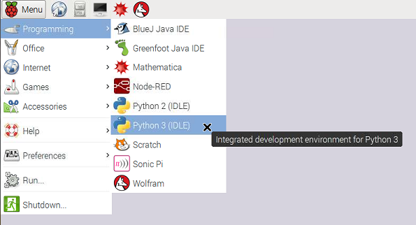
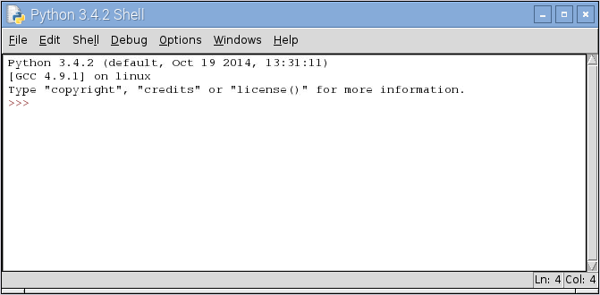
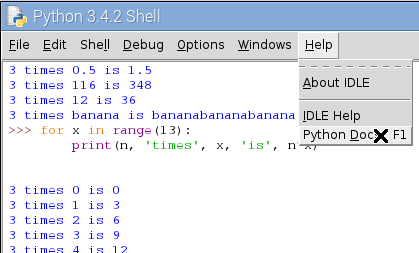

.. The shell

The shell: awesome calculator
#############################

We can talk directly to Python through a program called "the shell".
You can run the shell by launching IDLE.

Launching IDLE
**************

Launch IDLE from the "programming" section of the desktop menu.
The menu will look a little like this:

Make sure you pick IDLE 3.
This will open a "shell" window like this:

Python is ready to do things for you.
At the ``>>>`` prompt type ``6*7``.
The star ``*`` means multiplication.
Python will reply with the answer 42.

Now try this::
      
   >>> a = 7
   >>> b = 6
   >>> a * b
   42

``a`` and ``b`` are *variables*.
A variable is just a name you use for a value that matters to you.
The ``=`` means "make the name refer to this value".

When we tell Python to do a calculation,
instead of a number,
we can use a variable that refers to the number.
It could be an easy calculation, or one that's a bit complicated::

   >>> a + b
   13
   >>> (a+b) * (a-b)
   13

.. hint::

   You will often make mistakes and get rude, red error messages from Python.
   Don't worry: this is normal in programming.
   Nothing you do at the shell prompt ``>>>`` is long remembered.
   Try to guess what you did wrong and try again.

   If the shell prompt doesn't reappear, kill that window and start another shell.

You can make the variable (the name) mean something different any time you like.
Try::

   >>> a = 116

Let's re-calculate the complicated expression, but without typing.
In the IDLE shell, you can re-use lines you typed earlier.
Put the cursor on the line that says ``(a+b) * (a-b)``,
using the mouse or the arrow keys,
and press enter.
This makes a copy of that line at the prompt, as if you had typed it.
Press enter again, and Python will work it out::

   >>> (a+b) * (a-b)
   13420

This time, the meaning of ``a`` is different,
so you get a different answer.

.. sidebar:: About names for variables

   You can use almost name for a variable,
   made of letters, digits and the ``_`` character, but not spaces.
   An example is ``top_5_cats``.
   You can't start with a digit, because that looks like a number to Python.
   You can't use the 33 words already taken by Python
   (like ``for`` and ``in``),
   that come out orange in IDLE.
   You *can* use names like ``print`` or ``list``
   (purple in IDLE)
   that already mean something to Python,
   but it confuses humans.

   Programmers use short names (letters)
   for variables that are not needed for long.
   When a variable will be used in lots of places,
   they use long helpful names to remind them what it means.

A variable can refer to any kind of information.
Sometimes you want to refer to a *string* of text.
Strings are written in quotes.
Single and double quotes mean the same,
and you can use ``+`` to stick strings together::
    
   >>> h = 'Hello'
   >>> w = "world!"
   >>> h + ' ' + w
   'Hello world!'

Again, again!
*************

Just now, we used the same expression over again with a new value by copying.
Often, you need to work something out for a whole list of values.
Here is a list being assigned to a variable and printed out (try it)::

   >>> alist = [2, 0.5, a, 2*b, "banana"]
   >>> print(alist)
   [2, 0.5, 116, 12, 'banana']

Notice that the expressions in the list (like ``a`` and ``2*b``)
were calculated as the list was being made.

Now type at the prompt::

   >>> n = 3
   >>> for x in alist:
           print(n, 'times', x, 'is', n*x)

After the first line, the IDLE shell will move the cursor across,
so the next line starts in the right place.
It will do that again after your print statement
in case you have another line to enter.
Enter an empty line and it will know you've finished.

If you made a mistake,
use the trick you learned earlier
to copy your first attempt to the prompt so you can edit it.
Put the cursor at the end of the last line and press enter twice to try again.

What happened here?

Python looked at ``for x in`` and understood that you wanted to use
a *variable* called ``x``, and make it refer to each of the values in the list.
And for each different value given to ``x``,
you wanted to do what it says on the next line.
The ``print(...)`` part means print those things on a line in the shell window.

We call this whole thing a "for-loop",
because the computer goes round and round the same instructions,
once *for* each value.

Often we want to do this with a list of numbers.
Remember you can save typing using the copy trick,
just change ``alist`` to ``range(13)`` and hit return on the last line::

   >>> for x in range(13):
           print(n, 'times', x, 'is', n*x)

If you did it right, Python will have replied with the 3-times table.
Or the times-table for whatever you set ``n`` to.
Try the biggest number you can think of.

The ``range(13)`` that comes where ``alist`` used to be,
means "all the numbers from zero up to, but not including, 13".
You can see the lists ``range`` makes like this::

   >>> list( range(10) )
   [0, 1, 2, 3, 4, 5, 6, 7, 8, 9]
   >>> list( range(5,13) )
   [5, 6, 7, 8, 9, 10, 11, 12]

Space is big ... mind-bogglingly big
************************************

.. sidebar:: Super powers of the mathematician

    A mathematician would call these "the powers of 3".
    She would write them like this: 3\ :sup:`4`, 3\ :sup:`5` and 3\ :sup:`6`,
    and say them like "3 to the 4" and so on.
    
    Notice that the order of the numbers matters when you compute powers::
    
        >>> 6**10
        60466176
        >>> 10**6
        1000000

    6\ :sup:`10` is a much bigger number than 10\ :sup:`6` (a million).
    
    Try some really big powers.
    What are 3\ :sup:`100`, 3\ :sup:`1000`, and 3\ :sup:`10000`?
    What do you notice about the last few digits of these numbers?
    And do you get the same pattern with powers of other numbers (7 or 2, say)?
    Patterns in powers of numbers
    are behind the codes that keep us safe on the Internet.
    
    If you want to investigate this, Python will do the hard work for you.
    (Use what you learned about the for-loop to make tables of powers.)

Sometimes we need to multiply the same number together several times::

   >>> 3*3*3*3
   81

You *could* do that with a for-loop,
but there's a helpful shortcut for it::

   >>> 3**4
   81
   >>> 3**5
   243
   >>> 3**6
   729

Python will happily calculate enormous numbers.
Eighty tens multiplied together is roughly the number of atoms in the Universe::

   >>> 10**80
   100000000000000000000000000000000000000000000000000000000000000000000000000000000

That's still a small number to Python.
What's a thousand twos multiplied together (``2**1000``)?
Or ten-thousand?

If you keep going like this,
you will run out of computer memory or patience before Python gives up.

And my brain is so small
************************

Programmers can't possibly know everything about a language.
(Python has thousands of features.)
Don't worry, help is at hand.

If your machine is connected to the Internet
(or you have the documentation installed specially)
the IDLE menu "Help" >> "Python Docs" will take you there in a browser.

If you've followed this project to here,
you're already up to Chapter 3 of the Tutorial.

