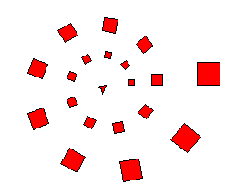
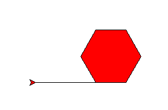

.. Project on spirals

Spectacular Spirals
###################

This project uses turtle graphics to draw spirals: choose your own design.
On the way, we meet a spiral that is 200 million years old.

First take your polygon
***********************

Start the project by making an empty file ``spiral.py``.
Right-click and open it with IDLE.
Type this (or copy most of it from ``final.py`` in the introduction) and save it:

.. code-block:: python
   :emphasize-lines: 5

   from turtle import *
   speed("fastest")

   def polygon(a, n):
       "n-sided polygon, side a."
       for i in range(n):
           forward(a)
           left(360/n)

The new line is called a *documentation string*,
a little reminder of what the function does.
It makes no difference to what the code does,
but in IDLE,
when you get as far as typing ``polygon(``,
IDLE will pop up this string as a reminder.

.. important::

   Never throw code away.

   In these projects we explain the program a piece at a time.
   Mostly you should **add** each new code fragment
   to the program you have already,
   normally at the end. 
   Sometimes the fragments show a **change** to what you have.

   Occasionally, there is a short fragment of code
   that you only need for a few tests, then you'll replace it.

   If ever *you* want to delete a lot of code,
   first use "File" >> "Save Copy As" and give a name like ``spiral_2.py``,
   so you can go back to your program as it was.

Offset and fill the polygon
***************************

Your program is going to draw lots of different spirals.
Here's a simple example where you can see what's going on:

Drawing starts with the smallest square tile, nearest the middle,
and continues anti-clockwise, putting down tiles.

Each tile is slightly bigger than the last.
Each circuit has the same number of tiles, that you choose, 9 in this case.
By the time it gets round once, the tile is twice the original size,
and twice as far from the centre.
It will go round as many times as you choose.

You will draw each tile with your ``polygon`` method.
To put it in the right place,
suppose the turtle is in the centre, and pointing the right way.
We need to go forward some distance, then draw the polygon.
Then we go back to the centre, ready for next time.

In code, it looks like this:

.. code-block:: python

   def tile(r, a, n):
       "n-sided polygon, side a, at range r (assumes pen is up)."
       forward(r)
       pendown()

       begin_fill()
       polygon(a, n)
       end_fill()

       penup()
       back(r)

**Add** that at the end of your program, and then **add** this to test it::

   # Test
   fillcolor("red")
   tile(100, 50, 6)

Lines that begin with a ``#`` are comments.
Python ignores them: they're a hint to the humans.
You should put comments in code you invent,
but you don't have to copy them in these examples.

Save and run that. It should look like this:

The initial line is not a fault:
it is there because we started with the pen down.

Turn and repeat
***************

Putting the tiles down in a spiral is still too difficult for us in one leap.
Think instead how would we put tiles down in a circle.

That would be rather like drawing a polygon,
except we use the ``tile`` function each time
instead of ``forward``.
**Add** after your last function:

.. code-block:: python

   def circ(r, scale, n, tiles):
       "Circle of n-sided polygons at radius r and size r/scale."
       # Angle between each tile
       step = 360 / tiles

       # Now draw it
       penup()
       for i in range(tiles):
           tile(r, r/scale, n)
           left(step)

**Change** your test code at the end to read:

.. code-block:: python
   :emphasize-lines: 3

   # Test
   fillcolor("red")
   circ(100, 10, 4, 9)

Save and run: you should get a circle of 9 little squares.

Grow a little each time
***********************

How can we turn the circle into a spiral?
This means making the distance from home (the radius)
and the tile size
grow each time a tile is placed.

Here "grow" means that we should multiply the size and the radius
by some amount each time we put down a tile.
The growth factor should be only a little more than one,
or the size will get huge in just a few tiles.
Remember what happens to powers of numbers from chapter 1?

We have to work out the starting radius and the growth per tile.
Choosing that number, a little bigger than one,
to get the final size you want,
is the the hardest part.
You may not have learned the maths for this yet,
but the comments explain what's happening.
**Add** after your last function:

.. code-block:: python

   def spiral(r, n, scale, cycles, m, growth):
       """Spiral of n-sided polygons out to radius r and size r/scale,
          in given number of cycles of m steps, growing each cycle.
       """
       # Angle between each tile
       step = 360 / m

       # Total number of tiles (made a whole number)
       p = int(cycles*m) + 1

       # Growth between each tile
       g = growth ** (1/m)

       # Starting radius (this will grow with each tile placed)
       r = r / (growth**cycles)

       # Now draw it
       penup()
       for i in range(p):
           # As the distance from the centre grows, so does the polygon
           tile(r, r/scale, n)
           left(step)
           r = r * g

You can see this is like the ``circ`` function,
but with extra code to make the size change.
Finally, we're ready to try this out.
At the end of your program, **add**:

.. code-block:: python

   def example():
       fillcolor("red")
       spiral(100, 4, 4, 2, 9, 2)

The call to ``spiral`` has a lot or arguments.
In order it says that you want:

* a final size of 100.
* squares (4 sides)
* ... that are 4 times smaller than the distance from the centre
* to go round twice
* to have 9 tiles per revolution
* to grow by a factor 2 each revolution

Save and run this.
Then at the shell prompt type::

   >>> example()

You should get the example we showed earlier.

Choose wild numbers
*******************

Here is a suggestion to **add**::

   def ammonite():
       pensize(1)
       color("peru", "wheat")
       spiral(100, 6, 3/2, 4.7, 22.5, 2)
       hideturtle()

.. sidebar:: The Ammonite

   This spiral looks like the shell of a creature
   that lived in Earth's oceans 200 million years ago.

   .. image:: ammonite.png
      :align: center

   The ammonite lived in the last chamber of a spiral shell,
   while the others it filled with air.
   It could only grow in proportion to the existing size of the shell:
   too big and it would sink and die,
   because there would not be enough air to keep it afloat.

   This exact proportion of the new chamber to the previous ones
   is the rule built into your program.
   Your program helps explain why the creature grew
   in a perfect geometric spiral.

And here is another a suggestion to **add**::

   def vortex():
       pensize(5)
       color("navy blue", "royal blue")
       spiral(500, 6, 3, 15, 4.2, 1.4)
       hideturtle()

Call them at the shell prompt, like you did with ``example()``.
The function call ``reset()`` will clear the drawing window between tests.

In the ``vortex`` you get a sort of two-way spiral
because the number of tiles per cycle is not a whole number,
but is close to a whole number (4.2).
So what might have been 4 straight lines becomes 4 curved lines.
What number would make them curve the other way?

Try calling ``spiral`` in your own function with a variety of numbers.
If you find a combination you like, give it a new name.

